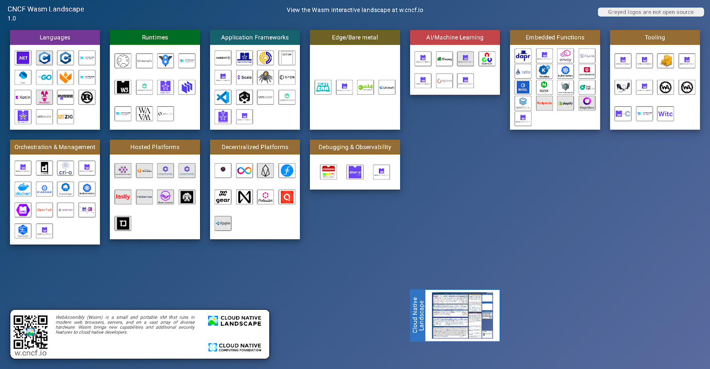
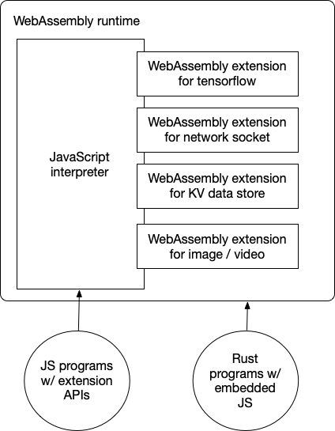

本文为译文，译者：Miley Fu, Vivian Hu

原文作者：Chris Aniszczyk、Vivian Hu 、Michael Yuan

原文链接：https://www.cncf.io/blog/2023/09/06/introducing-the-wasm-landscape/

“容器已成为新常态，WebAssembly 是未来。”

—— CNCF 2022 年年度调查主要发现。

WebAssembly(Wasm) 最初是为了在网页浏览器中运行编译的 C/C++ 代码而创建的一个安全沙箱，但它正在服务器端获得越来越多的关注和发展势头。在云端，Wasm 提供了一个轻量、快速、安全、跨语言、跨平台的应用程序运行时，可用于各种由用户提交的工作负载。它正在快速成为云原生技术栈的一个关键部分。

随着 Wasm 在云原生项目、产品和服务中的采用，CNCF 与 Wasm 社区合作创建了一个Wasm 生态全景图，以更好地理解 Wasm 生态的范围。正如最初的云原生全景图帮助勾画了围绕云原生技术的大量生态，我们相信随着生态的发展和增长，Wasm 也需要同样的全景图。

**[Wasm 全景图](https://landscape.cncf.io/wasm)** 第一版在 WasmCon 会议上发布，包括 11 个类别和 120 个项目或产品，代表总经济价值 594亿美元。 Wasm 全景图分为两大领域：Dev（应用程序开发）和 Ops（应用程序部署）。

## 应用程序开发

Wasm 应用程序开发需要自己的编程语言和相关工具生态，例如编译器、框架、库、工具和运行时。

### 编程语言

当开发者创建应用程序时，他们从选择一种编程语言开始！ Wasm 的特点之一是它能够运行用各种不同编程语言编写的应用程序。然而，这并不意味着所有编程语言都是平等的。

事实上，Wasm 全景图中有 4 类编程语言。

#### 编译语言

一等公民是可以直接编译为 Wasm 字节码并在 Wasm 运行时运行而无需任何依赖的语言。 **[C ](https://www.open-std.org/jtc1/sc22/wg14/)**、 **[C++ ](https://github.com/cplusplus/draft)**、 **[Zig](http://github.com/ziglang/zig)** 和 **[Rust](http://rust-lang.org/)** 都属于这一组。他们生产最快和最小的 Wasm 应用程序。

让我们以 Rust 为例。安装 Rust 语言后，你所需要做的就是添加 wasm32-wasi 目标。

#### 托管(Managed)语言

托管语言仍然是编译语言。但编译器输出需要“托管运行时”才能正常运行。托管运行时最常见的任务是垃圾收集（或 GC）。

对于 **[Kotlin](http://kotlinlang.org/)** 和 **[Dart 这样的语言](http://dart.dev/)**，Wasm GC 功能就足够了。 WasmEdge、Wasmtime 和 v8 等领先的 Wasm 运行时最近添加了 Wasm GC 支持。

对于 **[Go 来说](http://go.dev/)**，编译器将必要的运行时二进制文件嵌入到编译后的 Wasm 字节码中。这增加了 Wasm 应用程序的大小，但仍然提供了良好的开发者体验。

对于复杂的托管语言，例如 Java 和 **[.Net ](http://github.com/dotnet/runtime)**（例如C#），我们需要将它们的托管运行时（例如 JVM）与 Wasm 中的字节码应用程序一起编译和运行。这通常是一种不轻量的方法。

#### 脚本语言

JavaScript、Ruby、PHP 和 Python 等脚本语言也可以在 Wasm 中运行。这里的方法是将脚本语言解释器（通常用 C 编写）编译为 Wasm。然后基于 Wasm 的解释器程序就可以执行脚本了。

例如， VMware Labs 的 **[WebAssembly Laungage Runtimes 项目](http://wasmlabs.dev/projects/wasm-language-runtimes)**已将 Python 和 PHP 解释器移植到 Wasm。

**[WasmEdge QuickJS](https://github.com/second-state/wasmedge-quickjs)** 项目提供了一个 JavaScript 解释器以及一个支持 JavaScript 中的 node.js API 的 Wasm 库。

来源： **[WasmEdge QuickJS 文档](https://wasmedge.org/docs/develop/javascript/intro)**

#### “编译为 Wasm”的语言

最后但并非最不重要的是针对 Wasm 目标进行优化的新一代编译语言。他们仍处于非常早期的阶段。但如果做得好，他们有潜力成为 Wasm 全景图中真正的一等公民。

Moonbit 和 **[Grain](http://grain-lang.org/)** 是该类别中的两个领先示例。它们采用 Go 和 Rust 中的现代语言功能进行设计，并针对高效的 Wasm 编译和执行进行了优化。

**[Moonbit](http://moonbitlang.com/)** 虽然还处于早期阶段，但它配备了从动态代码补全到在线 IDE 的一整套工具。

### 运行时

一旦源代码被编译成 Wasm 字节码，你将需要 Wasm 运行时来执行它们。 Wasm 运行时提供了通常与 Wasm 相关的所有功能和优点，例如沙箱安全性、速度和跨平台可移植性。它们位于全景图的中心。

在这个云原生 Wasm 全景图中，我们将重点关注服务器端流行的 Wasm 运行时。我们有**[WasmEdge ](https://github.com/WasmEdge/WasmEdge)**（CNCF 沙箱）、 **[Wasmtime/lucet ](https://wasmtime.dev/)**、 **[Wamr、](http://github.com/bytecodealliance/wasm-micro-runtime)** **[WAVM ](https://github.com/WAVM/WAVM)**、**[Wasmer、](https://wasmer.io/)** **[wasm3 ](https://github.com/wasm3/wasm3)**、 **[Lunatic ](https://github.com/lunatic-solutions/lunatic)**、 **[wazero ](https://github.com/tetratelabs/wazero)**、 **[Wasmer](https://wasmer.io/)**和**[V8 ](https://v8.dev/)**。

* WasmEdge（CNCF 沙箱）是一个轻量级、高性能且可扩展的 WebAssembly 运行时，适用于云原生、边缘和去中心化应用程序。
* Wasmtime 是一个独立的仅用于 WebAssembly 和 WASI 的 wasm 优化运行时。
* WebAssembly Micro Runtime (WAMR) 是一种轻量级的独立 WebAssembly (Wasm) 运行时，具有占用空间小、高性能和高度可配置的功能，适用于从嵌入式、物联网、边缘到可信执行环境 (TEE)、智能合约、云原生等应用程序。
* WAVM 是一个 WebAssembly 虚拟机，设计用于非浏览器应用程序。
* Wasm3 是一个快速的 WebAssembly 解释器和最通用的 WASM 运行时。
* Lunatic 是一个受 Erlang 启发的 WebAssembly 运行时。
* wazero 是一个用 Go 编写的符合 WebAssembly 的解释器。
* Wasmer 是一个 WebAssembly 运行时，使轻量级容器能够在任何地方运行。
* V8 是 Google 开源的高性能 JavaScript 和 WebAssembly 执行引擎。

### 应用框架

Wasm 运行时类似于操作系统。库和框架为应用程序开发者提供了所需的高级且易于使用的组件。

WasmEdge 运行时的独特之处在于它支持超出 Wasm 标准的高级 POSIX API，它允许许多流行的 Rust 和 JS 应用程序框架，例如 tokio、hyper、reqwest、warp、node.js，以及 MySQL / Postgres / Redis / Kafka /ElasticSearch 客户端库，在 WasmEdge 中运行。然而，对于所有其他 Wasm 运行时，应用程序框架需要提供基本功能，例如 HTTP / HTTPS 网络和数据库访问。

在全景图的这部分中，我们涵盖了 **[Spin](https://www.fermyon.com/spin)**、**[WasmCloud ](https://wasmcloud.com/)**（CNCF 沙箱）、**[SpiderLightning](https://github.com/deislabs/spiderlightning)**、 **[WasmEdge plug-ins](https://wasmedge.org/docs/start/wasmedge/extensions/plugins)**、**[Dapr SDK for WasmEdge](https://github.com/second-state/dapr-sdk-wasmedge)**、**[Homestar](https://github.com/ipvm-wg/homestar)**、**[Ambient](https://www.ambient.run/)**、**[WASIX](https://wasix.org/)**、**[Extism](https://github.com/extism/extism)**、**[Timecraft](https://github.com/stealthrocket/timecraft)**、**[vscode-wasm](https://code.visualstudio.com/blogs/2023/06/05/vscode-wasm-wasi)** 和 **[WasmEx ](https://github.com/tessi/wasmex)**。

* Spin 是一个流行的应用程序框架和组件库，用于构建 WebAssembly 微服务和 Web 应用程序。它与 wasmtime 运行时一起使用。
* WasmCloud 允许使用 WebAssembly 参与者和能力提供者进行简单、安全、分布式应用程序开发。
* SpiderLightning 是一组 **[WIT](https://github.com/WebAssembly/component-model/blob/main/design/mvp/WIT.md)** 接口，它抽象了分布式应用程序能力和运行时 CLI，用于运行使用这些能力的 Wasm 应用程序。
* 虽然 WasmEdge 支持用于 HTTP 和数据库访问的流行 Rust 应用程序框架，但它还可以通过支持 TLS 网络、zlib、OpenCV、ffmpeg、PyTorch、Tensorflow 和大型语言模型 (LLM) 推理等框架和库的 plugin 来进一步补充。
* 用于 WasmEdge 的 Dapr SDK 是用 Rust 实现的实验性 Dapr SDK。它允许基于 WasmEdge 的微服务通过 Dapr sidecar 访问 100 多个企业服务。
* Homestar 是 IPVM 的Rust 实现和运行时。
* Ambient 是一个用于构建高性能多人游戏和 3D 应用程序的运行时，由 WebAssembly、Rust 和 WebGPU 提供支持。
* WASIX 是 WASI 的超集。
* Extism 是通用插件系统。由 WebAssembly 提供支持。
* Timecraft 是一个软件运行时，它执行具有沙箱、任务编排和时间旅行能力的 WebAssembly 模块。
* vscode-wasm 是一个 WASI 实现，它使用 VS Code 的扩展主机作为实现 API。
* Wasmex 是针对 Elixir 的快速、安全的 WebAssembly 和 WASI 运行时。

### 边缘/裸金属

Wasm 的一个关键特性是跨平台可移植性，这意味着能够跨不同操作系统和 CPU 架构执行相同的字节码应用程序。在 JVM 时代，操作系统仅限于类 Unix 系统（例如Linux）、Windows 和 MacOS。然而，Wasm 可以在边缘和物联网计算中常用的非传统系统上运行。

Docker 和 Linux 容器从来都不是跨平台的。例如，容器镜像必须与主机 CPU 匹配。

* **[Genode](https://github.com/genodelabs/genode)** 是一个免费的开源的软件操作系统 (OS) 框架，由微内核抽象层和一组用户空间组件组成。
* **[SeL4 RTOS](https://sel4.systems/)** 是高可靠、高性能的操作系统微内核，经过全面的形式化验证，且不影响性能。
* Flatcar Container Linux 是一个轻量级、精简版的 Linux 发行版，专为容器设计。它是 Wasm 运行时的绝佳 host。
* **[Unikraft](https://unikraft.org/)** 是一个快速、安全且开源的 Unikernel 开发套件。

### AI 推理

随着人工智能工作负载在云数据中心越来越受欢迎，Wasm 越来越多地用作重量级、复杂且缓慢的 Python 堆栈的替代方案。 WASI NN 规范定义了 Wasm 运行时应如何与本机 AI/ML 库（例如 PyTorch 和 TensorFlow）交互，以使用 Rust 等高性能语言进行 AI 推理。

Wasmtime、WasmEdge 和 WAMR 是支持 WASI NN 的 Wasm 运行时。

例如，WasmEdge 运行时支持 **[OpenVINO ](https://wasmedge.org/docs/develop/rust/wasinn/openvino)**、 **[Pytorch ](https://wasmedge.org/docs/develop/rust/wasinn/pytorch)**、 Tensorflow 、 **[TensorFlow Lite](https://wasmedge.org/docs/develop/rust/wasinn/tensorflow_lite)** 和 **[MMGL/Llama2](https://github.com/karpathy/llama2.c)** 作为推理后端，以及 **[OpenCV ](http://opencv.org/)**、 **[ffmpeg](http://ffmpeg.org/)** 作为预处理器或后处理器。同时也支持 mediapipe、document AI、llama2等多种模型。

### 嵌入式函数

Wasm 可以安全地执行用户定义或社区贡献的代码作为软件产品中的嵌入式函数（或插件）。

在 Wasm 全景图的这一部分中，我们展示了选择并集成 Wasm 作为插件机制的软件产品。最长的类别是数据库和数据流应用程序，其中的 Wasm 用于执行用户定义函数（UDF）。

**[Libsql](https://libsql.org/)**、**[OpenGauss](https://opengauss.org/en/)** 和 **[Singlestore](https://www.singlestore.com/)** 等数据库以及 **[Open Policy Agent](https://www.openpolicyagent.org/)**、**[InfinyOn](https://infinyon.com/)**、**[YoMo](https://github.com/yomorun/yomo)**、**[eKuiper](https://ekuiper.org/)** 和 **[Redpanda](https://redpanda.com/)** 等消息队列正在使用 Wasm 来执行 UDF。 **[Envoy](https://www.envoyproxy.io/)**、**[Istio](http://github.com/istio/istio)**、**[APISIX](https://apisix.apache.org/)**、**[KubeWarden](https://www.kubewarden.io/)** 和 **[NGINX](https://www.nginx.com/)** 等流量代理正在使用 Wasm 在数据平面中执行自定义逻辑。 **[OpenFunction](http://openfunction.dev/)** 和 **[Knative](http://knative.dev/)** 等 FaaS 平台允许将 Wasm 函数嵌入到 Kubernetes Pod 中。

* Libsql 是 SQLite 的开源、开放贡献分支。它的目标是将 SQLite 带入服务器端。
* OpenGauss 是一款高性能、高安全、高可靠的企业级开源关系数据库。
* SingleStore 是分布式 SQL 数据库，旨在为数据密集型应用程序提供支持。
* Open Policy Agent 是一个开源的通用策略引擎。
* InfinyOn 是可组合的统一数据流平台。
* YoMo 是一个开源流媒体 serverless 框架，用于构建低延迟地理分布式系统。
* eKuiper 是一款边缘轻量级物联网数据分析/流媒体软件。
* Redpanda 是一个简单、强大且经济高效的流数据平台，它与 Kafka® API 兼容，同时消除了 Kafka 的复杂性。
* Envoy 是一个开源边缘和服务代理，专为云原生应用程序而设计。
* Istio 是一个开源服务网格，可以透明地分层到现有的分布式应用程序上。
* Apache APISIX 是一个动态、实时、高性能的 API 网关。
* Kubewarden 是 Kubernetes 的策略引擎。其使命是简化策略即代码的采用。
* Nginx 是一个 Web 服务器，也可以用作反向代理、负载均衡器、邮件代理和 HTTP 缓存。
* OpenFunction 是一个云原生开源 FaaS（函数即服务）平台。

### 工具链

最后，开发者依靠工具将语言、框架、库和运行时拼凑成工作应用程序。工具链的成熟度是衡量整个开发者生态成熟度的重要指标。在 Wasm 全景图，我们介绍了用于构建 Wasm 应用程序的重要工具。

* **[Cargo](https://github.com/rust-lang/cargo)**：从 Rust 源代码构建 Wasm 应用程序。它提供了现代的依赖管理工具和源代码 repo。
* **[LLVM](https://llvm.org/)**：理论上，任何有 LLVM 后端的语言都可以编译成 Wasm。
* **[Binaryen](https://github.com/WebAssembly/binaryen)**：WebAssembly 的编译器和工具链基础设施库
* **[Emscripten](https://emscripten.org/)**：使用 **[LLVM](https://en.wikipedia.org/wiki/LLVM)** 和 **[Binaryen将 C 和 C++ 编译为WebAssembly ](https://github.com/WebAssembly/binaryen/)**。
* **[wasm-pack](https://rustwasm.github.io/wasm-pack/)**：将 Rust 编译为 Wasm，可以在浏览器中或 Node.js 中与 JavaScript 交互
* **[wasm-bindgen](https://github.com/rustwasm/wasm-bindgen)**：促进 Wasm 模块和 JavaScript 之间的高级交互
* **[Wabt](https://github.com/WebAssembly/wabt)**：WebAssembly 的一套工具，包括 wat2wasm、wasm2wat、wasm2c 等。
* **[Witc](https://github.com/second-state/witc)**：编译器为 .wit 文件生成代码
* **[Wit bindgen](https://github.com/bytecodealliance/wit-bindgen)**：**[WIT](https://github.com/WebAssembly/component-model/blob/main/design/mvp/WIT.md)** 和[组件模型](https://github.com/WebAssembly/component-model)的客户语言绑定生成器
* **[Asyncify ](https://web.dev/asyncify/)**：一个 JavaScript 包装器，旨在与 Binaryen 的 Asyncify 功能一起使用。

## 应用程序部署

创建 Wasm 应用程序后，下一步是在生产中部署和扩展它。云原生全景图中有大量的工具、框架和服务来管理应用程序部署。其中许多都集成了 Wasm 支持。

### 编排与管理

Wasm 容器可以通过 Docker、containerd 和 Kubernetes 等现有容器工具进行无缝管理。有两种方法可以将 Wasm 应用程序作为“容器”进行管理。这两种方法都可以让你构建并行运行 Linux 容器和 Wasm 容器的 Kubernetes 集群。

方法#1是在容器管理堆栈的基础上使用 OCI 运行时，例如 crun 和 **[youki 。 ](http://github.com/containers/youki)**crun 根据镜像的目标操作系统和 CPU 平台检测 OCI 镜像是 wasm 还是 Linux。如果镜像的目标是 wasi/wasm，crun 将绕过 Linux 容器设置过程，只使用 WasmEdge 来运行它。基于**[crun](https://wasmedge.org/docs/develop/deploy/oci-runtime/crun)**，我们可以获得整个 **[Kubernetes](https://kubernetes.io/)** 堆栈来运行 Wasm 镜像，包括 **[CRI-O ](https://cri-o.io/)**（CNCF项目）、 **[containerd（CNCF项目） ](https://containerd.io/)**、**[Podman](https://podman.io/)**、**[kind](https://kind.sigs.k8s.io/)**、**[K8s ](https://kubernetes.io/)**（CNCF项目）、 **[OpenYurt ](https://openyurt.io/)**（CNCF项目）、 **[SuperEdge ](https://superedge.io/)**（CNCF项目）、 **[KubeEdge ](https://kubeedge.io/)**（CNCF 项目）。

方法#2是使用 containerd-shim（例如 **[runwasi ](https://github.com/containerd/runwasi)**）在 containerd 中运行 Wasm 应用程序。当 containerd 接收到镜像时，它会检查镜像的目标平台，如果镜像是 wasi/wasm，它会路由到 runwasi 执行，如果镜像是 x86 或 arm，它会路由到 runc。

在 Kubernetes 的基础上，我们还介绍了一些新兴工具来帮助管理生产 Wasm 工作负载。

**[Kuasar](https://kuasar.io/)** 是另一个支持多种类型沙箱的容器运行时，包括 microVM、Linux 容器、应用程序内核和 WebAssembly 运行时。

**[Kwasm](https://kwasm.sh/)** 是一个 Kubernetes Operator，它为你的 Kubernetes 节点添加了 WebAssembly 支持。它可与基于 Ubuntu/Debian 和 Containerd 的本地和托管云 K8s 发行版配合使用，

**[container2wasm](https://github.com/ktock/container2wasm)** 是一个容器到 wasm 镜像转换器，可以在 WASM 上运行容器。

### 托管（Hosted）平台

如果你不想麻烦地运行自己的服务器和 Kubernetes 集群，那么托管平台是将 Wasm 应用程序部署和扩展为服务的绝佳选择。

* **[Flows.network](https://flows.network/)** 是一个用于 AI 原生工作流程自动化的 serverless Wasm 平台。
* **[Fermyon Cloud](https://www.fermyon.com/cloud)** 是部署和管理使用 Spin 框架编写的 serverless Wasm 函数。
* **[Cosmonic](http://cosmonic.com/)** 是部署在 WasmCloud 上的基于 Wasm 的 Actor 服务。
* **[Cloudflare Workers](https://workers.cloudflare.com/)** 是 Cloudflare 边缘网络上由 v8 支持的 Wasm 和 JavaScript  serverless 函数运行时。
* **[Fastly @Edge Function ](http://fastly.com/products/edge-compute)** 是部署在 Fastly 边缘网络上的 serverless Wasm 函数平台。
* **[AKS](https://azure.microsoft.com/en-us/products/kubernetes-service)**：支持在 Azure Kubernetes Service (AKS) 中创建 WASI 节点池以运行 WebAssembly (WASM) 工作负载
* **[Taubyte](https://taubyte.com/)** 是一个用于运行应用程序的云原生平台，尤其是 Wasm 应用程序。
* **[Golem Cloud](https://www.golem.cloud/platform)** 是一个计算平台，允许开发者在 Wasm 中构建和部署长期运行、有状态的 serverless 工作线程。

### 去中心化平台

基于区块链的智能合约平台是去中心化的云计算网络。你的云应用程序（即智能合约）不是由中心 Operator 运行所有工作负载，而是由网络中的节点执行。由于智能合约不受信任并且必须非常频繁地执行（每台计算机每秒数百次），因此 Wasm 是该应用场景的理想执行引擎。事实上，几乎所有领先的智能合约区块链网络都采用了 Wasm。

* **[Polkadot](https://www.polkadot.network/)**
* **[NEAR](https://near.org/)**
* **[Dfinity](https://dfinity.org/)**
* **[GEAR](https://gear.foundation/)**
* **[Filecoin](https://filecoin.io/)**
* **[Ripple](http://ripple.com/)**
* **[EOS](https://eosnetwork.com/)**
* **[CosmWasm](https://cosmwasm.com/)**
* **[Quai Network](http://qu.ai/)**

### 调试和可观测性

调试和可观测性是重要的生产功能，使运维团队能够持续监控应用程序并向开发团队提供有用的反馈。这是 Wasm 全景图中目前有所缺乏的部分。我们预计这个领域会随着 Wasm 越来越多地部署在生产中而生长壮大。

* **[WASI logging](https://github.com/WebAssembly/wasi-logging)** 是用于发出日志消息的 Wasm 规范。它得到领先的 Wasm 运行时（例如 wasmtime 和 WasmEdge）的支持。
* **[Modsurfer](https://github.com/dylibso/modsurfer)** 为运营和开发团队提供了第一个记录系统 + 诊断应用程序，用于搜索、浏览、验证、审核和调查 Wasm 二进制文件。

### Artifacts

Artifacts repo 是全景图中的重要元素。它们提供集中且始终可用的位置来存储、发现、验证、下载、跟踪多个已发布版本的 Wasm 包。它们不仅是便利的工具，而且对于软件供应链安全也至关重要。

* **[Docker Hub](https://hub.docker.com/)** 是创建、管理和交付团队容器应用程序的地方。如果你在 Docker Hub 上上传纯 Wasm 镜像，则镜像的操作系统/架构将被标记为 wasi/wasm。
* **[Harbor](https://goharbor.io/)** 是一个开源的可信云原生 registry 项目，用于存储、签名和扫描内容。它支持 Wasm 工件。
* **[Warg](https://github.com/bytecodealliance/registry)** 是一个 WebAssembly 组件 registry。
* **[wapm](https://wapm.io/)** 是 WebAssembly 的包管理器。
* **[crates.io](http://crates.io/)** 是 rust 的 crate registry，它是最常用的 Wasm 语言。

## 帮助我们构建 Wasm 全景图

Wasm 全景图是社区的努力，随着 Wasm 采用的兴起，Wasm 全景图也在快速发展。我们打算随时更新最新进展。然而，我们只有在整个 Wasm 社区的帮助下才能做到这一点。 \
如果有任何想要添加或更新的内容，请提交 PR！可以参考[此 PR](https://github.com/cncf/landscape/pull/3475)添加你的项目名称、logo、网站、GitHub  repo 链接和 crunchbase。
